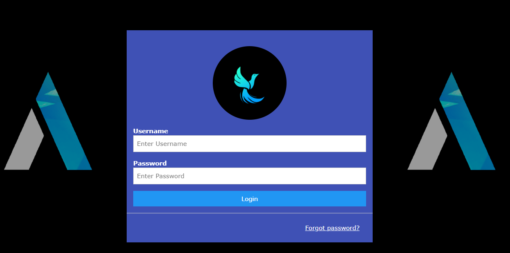
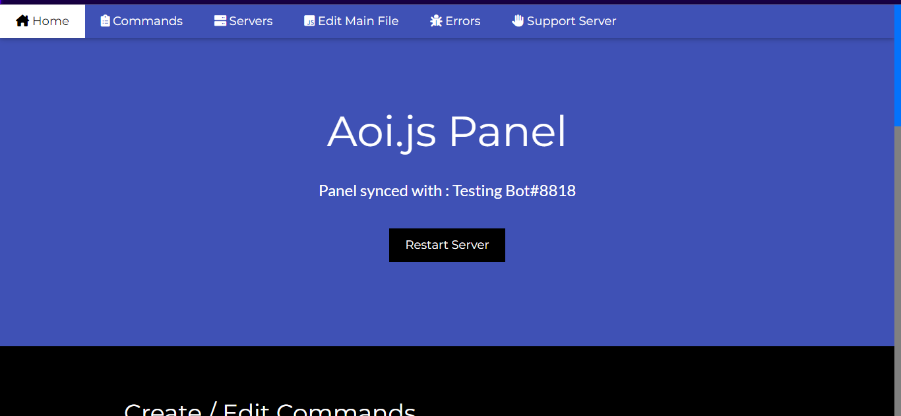
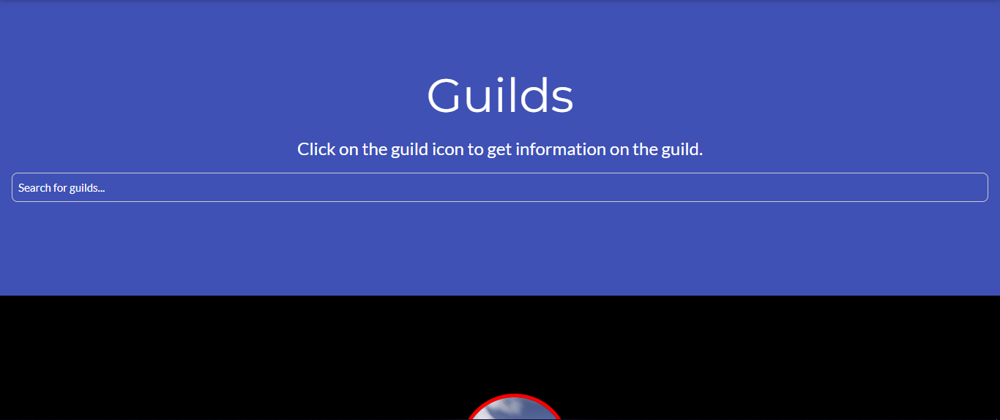
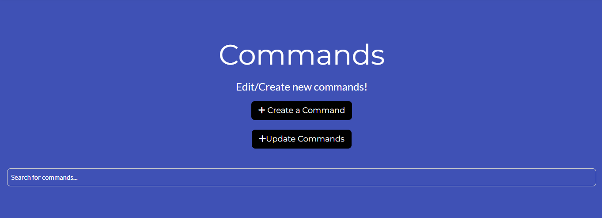

# A [Discord Bot + Developer Panel](https://github.com/BrianMitc010905/aoijs.js-Discord-Bot-and-Developer-Panel) Made By [BrianMitc010905](https://github.com/BrianMitc010905)`Discord Bot` and [Akarui Development Team](https://github.com/AkaruiDevelopment) `Developer Panel`
---
# THIS IS A `INCOMPLETE` VERSION 
`I will not be responsible for any harm it makes to you in this stage. The official version will be released soon after which you are safe to go. All the rights of this application belongs to me. Proper credits to be provided for any sort of sharing activity.`
---
## PLEASE "`DON'T USE`" IF YOU `DON'T KNOW` HOW TO USE `aoi.js`!!
---
### If Using `Replit.com` Use `Replit Secrets` for the `.env` 
#### If Not Change The `example.env` file to just `.env`
---
## INFO: 
- Hello This is INCOMPLETE Template For people that use Aoi.js & @akarui/aoi.panel
- I'm Still In Development. 
- Being Developed With a NodeJS Package aoi.js & @akarui/aoi.panel
- Dev Panel Made By: Akarui Development Team. Join There Discord Here: https://discord.gg/DJwbGR64HH
- Discord Bot Made By: BrianMitc#7316 
---
# Sneek Peeks
---

  

---
!
---

---

---

---
## Please Send Feedback in this fourm: 

- LINK: https://forms.gle/VNHoz4JFHR3RQYnQ6
---
## LINKS:
- @akarui/aoi.panel NPM LINK:
- https://www.npmjs.com/package/@akarui/aoi.panel
---
- aoi.js NPM LINK:
- https://www.npmjs.com/package/aoi.js
---
- Leref NPM USER LINK:
- https://www.npmjs.com/~leref
---
## To Keep Your Bot Online 24/7 on Replit.com
- Express(For To keep online 24/7) NPM LINK: 
- https://www.npmjs.com/package/express
---
### Use Both to Keep it online!
- UpTimeRobot LINK: (Use Your Web Link in the replit to keep online 24/7)
- https://uptimerobot.com/dashboard
- Fresh Ping:
- https://www.freshworks.com/website-monitoring/
---
## For Support Contact Me:
- Email Me: `support@seendevelopment.tech`
- My Discord: `BrianMitc#7316`
---
